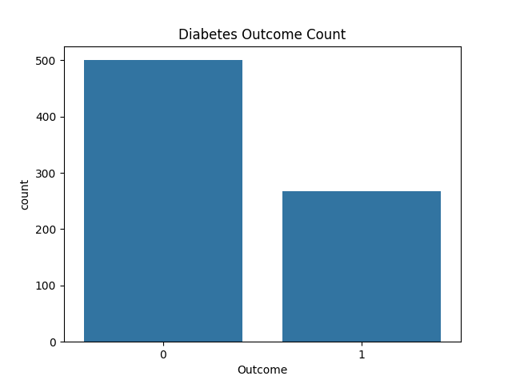
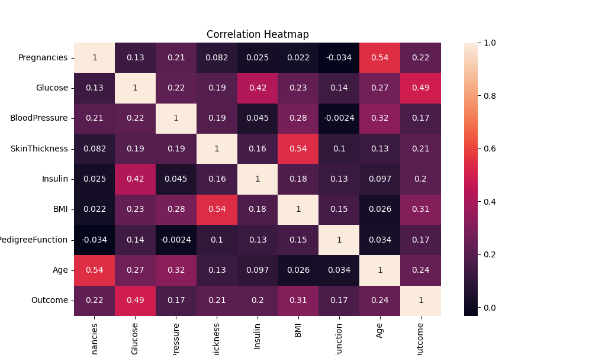

# Diabetes Prediction using Machine Learning

## Problem Statement
The goal of this project is to predict whether a patient has diabetes based on diagnostic medical features.

## Dataset
Pima Indians Diabetes Dataset  
768 rows, 9 columns.

## Workflow Followed
1. Data Loading
2. Data Cleaning (handling impossible zero values)
3. Exploratory Data Analysis (EDA)
4. Feature Preparation
5. Logistic Regression Model
6. Model Evaluation

## Results
- Accuracy: **75%**
- Logistic Regression performed reasonably well for this dataset.

## Visualizations

### Outcome Count

### Correlation Heatmap

## Tools Used
- Python
- Pandas
- Seaborn
- Scikit-learn
- VS Code

## Conclusion
Basic medical attributes can be used to reasonably predict diabetes using a simple machine learning model.
This project analyzes diabetes data using Python.

## Files
- `diabetes_analysis.py`: Main analysis script
- `diabetes.csv`: Dataset containing diabetes information
- `diabetes_project`: [Description if needed]

## Setup
1. Ensure Python is installed.
2. Install required packages: [list if any]
3. Run the analysis: `python diabetes_analysis.py`

## Usage
[Add usage instructions here]

## Contributing
[Add contribution guidelines if applicable]